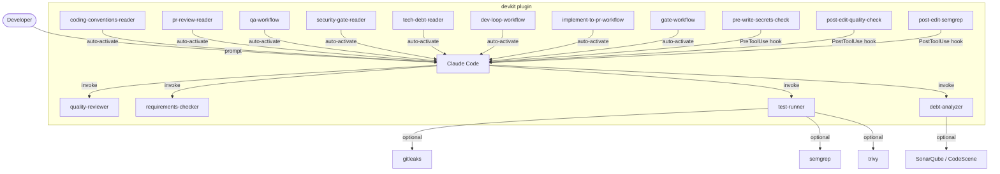

# devkit

[](https://opensource.org/licenses/MIT)
[](https://claude.ai/code)
[](https://github.com/3eer/devkit/releases)
[](https://github.com/3eer/devkit)

> AI-driven development harness plugin for Claude Code.
> Quality gates, autonomous QA loops, security scanning, and tech-debt visibility.

Claude Code 向け AI 駆動開発ハーネスプラグイン。**Claude Code（Agent/Skill）と Cursor（Task/Read）の両方**で workflow を実行できる手順を各スキルに記載しています。

---

## Architecture / アーキテクチャ

devkit は Claude Code をハーネス基盤として使用し、品質保証レイヤー (V層) と拡張ポイント (T/C層) を追加します。

```
┌─────────────────────────────────────────────────────────────┐
│                         devkit                              │
│                                                             │
│  C (Context)    skills/           coding-conventions-reader   │
│                                   pr-review-reader            │
│                                   qa-workflow                 │
│                                   gate-workflow               │
│                                   dev-loop-workflow           │
│                                   implement-to-pr-workflow    │
│                                   security-gate-reader        │
│                                   tech-debt-reader            │
│                                                             │
│  T (Tools)      hooks/            pre-write-secrets-check   │
│                                   post-edit-quality-check   │
│                                                             │
│  V (Validation) agents/           dev-lead / dev-developer / dev-qa   │
│                                   quality-reviewer    (review)        │
│                                   requirements-checker (review)       │
│                                   test-runner         (QA+sec)        │
│                                   debt-analyzer       (debt)          │
└─────────────────────────────────────────────────────────────┘
         ↕ Claude Code 標準 (E / S / L 層)
┌─────────────────────────────────────────────────────────────┐
│  E (Execution)  /sandbox / devcontainer                     │
│  S (State)      session memory / /compact                   │
│  L (Loop)       agent loop / subagents                      │
└─────────────────────────────────────────────────────────────┘
```



---

## Install / インストール

### 1. Marketplace を登録する

```
/plugin marketplace add 3eer/devkit
```

### 2. プラグインをインストールする

```
/plugin install devkit@3eer-devkit
```

---

## Skills / スキル

devkit の入口は **スキルのみ**（slash command は廃止）。自然言語・スキル attach・各 SKILL.md の triggers で起動する。

| スキル | 説明 | 起動例 |
|--------|------|--------|
| `dev-loop-workflow` | 設計→実装→検証→commit→PR→受け入れテスト依頼 | 「設計からPRまで」「フィルタ機能を追加して開発ループで」 |
| `implement-to-pr-workflow` | 受け入れ条件付き実装→PR（設計済み向け） | 「AC: … を満たして PR まで」「ship it」 |
| `gate-workflow` | フル品質ゲート（quick / full / report） | 「品質ゲート full」「gate report」 |
| `pr-review-reader` | PRレビュー・リスク評価 | 「PR 42 をレビューして」「マージ前確認」 |
| `security-gate-reader` | セキュリティスキャン | 「セキュリティスキャンして」「src/ を scan」 |
| `qa-workflow` | 自律QAループ（最大5イテレーション） | 「テストが通るまで」「test loop」 |
| `tech-debt-reader` | 技術負債・ホットスポット | 「技術負債分析」「src/api の hotspot」 |
| `coding-conventions-reader` | コーディング規約（主に自動起動） | コード生成・実装開始時 |

**Cursor:** スキル md を `Read` し手順に従うか、`Task` で subagent を起動（`dev-loop-workflow` の Harness 表参照）。

---

## Examples / 使用例

### フル品質チェックを走らせる

```
品質ゲート full を実行して
```

```
## Gate Report — 2026-05-17

### テスト結果
- 総テスト数: 142 / 通過: 140 / 失敗: 2

### セキュリティスキャン
- gitleaks: クリーン
- semgrep: 1件 ERROR (src/api/handler.ts:83)
- trivy: クリーン

### 技術負債スコア: 68/100
ホットスポット: src/api/handler.ts (スコア: 82)

### 推奨アクション
1. [Critical] semgrep: SQL injection risk at handler.ts:83
2. [Important] 2件のテスト失敗を修正
3. handler.ts を分割リファクタ (847行)
```

---

### PRをマージ前にレビューする

```
PR 42 をレビューして
```

```
## Code Reviewer Report — PR #42

**リスクレベル:** 中 (スコア: 35)
**マージ推奨:** 修正後OK

### Important
1. [src/auth/session.ts:14] セッショントークンがログに出力されています
2. [src/api/user.ts:89] ユーザー入力が未検証でクエリに渡されています

### 総評
認証周りの変更が含まれており、2点の修正が必要です。
修正後はマージ可能な変更です。
```

---

### テストが通るまで自動修正させる

```
テストが通るまで修正して
```

```
QA Loop — イテレーション 1/5
  テスト実行: npm test
  失敗: 3件
  → TypeError: Cannot read property 'id' of undefined (user.test.ts:45)
  → 根本原因: user が null の場合のガード処理が欠落
  → src/models/user.ts を修正中...

QA Loop — イテレーション 2/5
  テスト実行: npm test
  失敗: 0件 ✓

## QA Loop 完了レポート
結果: 全テスト通過
イテレーション数: 2回
修正したファイル: src/models/user.ts
```

---

### 技術負債のホットスポットを特定する

```
src/ の技術負債を分析して
```

```
## Debt Analyzer Report — src/

コード健全性スコア: 62/100

### ホットスポット Top 3

| ファイル | 変更頻度/90日 | 行数 | TODO数 | スコア |
|---------|-------------|------|--------|--------|
| src/api/handler.ts | 23回 | 847 | 8 | 82 |
| src/db/queries.ts | 18回 | 612 | 3 | 71 |
| src/auth/session.ts | 15回 | 445 | 5 | 65 |

### Quick wins (1-3時間)
- [ ] handler.ts の TODO 8件を解消
- [ ] session.ts のネスト深度を削減 (アーリーリターン)

### Middle-term (1週間)
- [ ] handler.ts を責務別に3ファイルに分割
```

---

### シークレットが検出されたとき

```typescript
// これを書こうとすると...
const apiKey = "sk-xxxxxxxxxxxxxxxxxxxx";
```

```
[devkit] OpenAI API Key が検出されました。
機密情報をソースコードに直接書き込まないでください。
環境変数を使用し、値は .env ファイルに記載してください（.env はコミットしない）。
```

---

## Agents / エージェント

| エージェント | 役割 | ツール |
|------------|------|--------|
| `dev-lead` | 設計・裁定・承認ゲート（dev-loop 常駐） | Read, Glob, Grep, Bash, Agent, Skill |
| `dev-developer` | dev-lead 計画に従う実装者 | Read, Write, Edit, Glob, Grep, Bash, Skill |
| `dev-qa` | 実機検証・差し戻し | Read, Glob, Grep, Bash, Skill |
| `quality-reviewer` | コードレビュー専任（正確性・信頼性・テスト品質） | Read, Glob, Grep |
| `requirements-checker` | 要件充足専任（仕様書自動探索・AC照合・実装漏れ/過剰検出） | Read, Glob, Grep |
| `security-auditor` | PRレビュー時のセキュリティ監査専任（Red Team・OWASP） | Read, Bash, Glob, Grep |
| `type-checker` | 型安全性・インターフェース設計専任 | Read, Glob, Grep |
| `test-runner` | QA・テスト実行専任（gate-workflow 時のセキュリティスキャンも担当） | Read, Bash, Glob, Grep |
| `debt-analyzer` | 技術負債・アーキテクチャ分析専任 | Read, Glob, Grep |
| `ux-reviewer` | UX整合性・アクセシビリティ専任（UI変更PRで自動追加） | Read, Glob, Grep |
| `fact-collector` | Deep Research 用情報収集専任 | Read, WebSearch, WebFetch |
| `fact-verifier` | Deep Research 用情報検証専任 | Read, WebSearch, WebFetch |
| `report-writer` | Deep Research 用レポート生成専任 | Read |

---

## Hooks (自動フック)

インストール後、**グローバル設定を変更せず**に以下が自動で有効になります:

| タイミング | フック | 内容 |
|-----------|--------|------|
| Read 前 | `pre-read-env-block` | `.env` 等の機密パス読み取りブロック |
| Write/Edit 前 | `pre-write-secrets-check` | シークレット検出 (gitleaks 優先 → regex fallback) |
| Bash 前 | `pre-bash-deny-commands` | force push / main push / rm -rf 等の拒否 |
| Write/Edit 後 | `post-edit-quality-check` | 言語別 lint / typecheck (TS / Python / Go / Rust) |
| セッション終了時 | `stop-quality-summary` | 変更ファイルがある場合のみ簡易サマリーを表示 |

---

## Optional Tools / オプション外部ツール

未インストールでも **graceful degradation** で動作します。インストールするとより精度が上がります:

```bash
# macOS
brew install gitleaks semgrep trivy golangci-lint conftest
```

| ツール | 用途 | 未インストール時 |
|--------|------|----------------|
| [gitleaks](https://gitleaks.io/) | シークレット検出 (高精度) | regex fallback |
| [semgrep](https://semgrep.dev/) | SAST | スキップ |
| [trivy](https://trivy.dev/) | 依存関係脆弱性・コンテナスキャン | スキップ |
| [golangci-lint](https://golangci-lint.run/) | Go lint | `go vet` fallback |
| [conftest](https://conftest.dev/) | OPA ポリシーチェック | スキップ |

---

## gitStream Integration / gitStream 連携 (任意)

PRの自動リスク評価・自動承認を有効にするには:

1. [gitStream GitHub App](https://github.com/apps/gitstream-cm) をインストール
2. `.cm/gitstream.cm` をプロジェクトルートにコピー:
   ```bash
   mkdir -p .cm
   cp "$(claude plugin root devkit@3eer-devkit)/.cm/gitstream.cm" .cm/gitstream.cm
   ```

| ラベル | 動作 |
|--------|------|
| `devkit:low-risk` | 自動承認 (docs/test のみ、10ファイル未満) |
| `devkit:medium-risk` | AIレビュー推奨コメントを投稿 |
| `devkit:high-risk` | 人間レビュー必須 + シニアエンジニアをアサイン |

---

## Design / 設計思想

devkit はハーネスエンジニアリングの観点で設計されています。Claude Code が提供する E/S/L 層を基盤として、その上に T/C/V 層を追加します:

| 層 | 意味 | 提供者 |
|----|------|--------|
| E (Execution) | サンドボックス実行環境 | Claude Code 標準 |
| T (Tools) | ツール定義・フック | **devkit** |
| C (Context) | スキル・プロンプト基盤 | **devkit** |
| S (State) | セッションメモリ | Claude Code 標準 |
| L (Loop) | エージェントループ | Claude Code 標準 |
| V (Validation) | ガードレール・評価・トレース | **devkit** |

グローバル設定を汚染しない自己完結型なので、チームへの配布・導入が安全です。

---

## License

MIT © [3eer](https://github.com/3eer)
